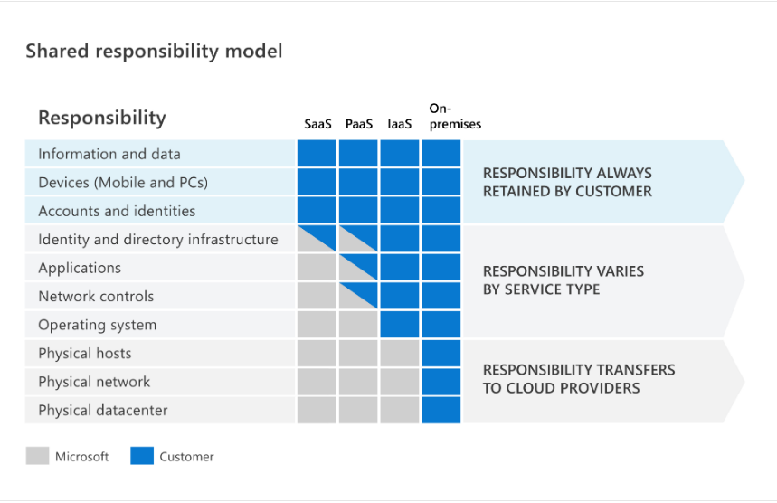

[//]: # (title: Azure Fundamentals - Cloud computing)
[//]: # (description: Condensé de la formation Azure Fundamentals)
[//]: # (author: PhxDesign)
[//]: # (ms.author: jlgauthier)
[//]: # (ms.topic: Cloud computing)
[//]: # (ms.date: 01/15/2023)

# Azure Fundamentals - Cloud computing

Condensé sur la formation Azure Fundamentals permettant d'obtenir la certification AZ-900.

## Qu'est-ce que le cloud computing?

Le cloud computing consiste à fournir des services informatiques sur Internet. Les services informatiques comprennent l’infrastructure informatique courante, par exemple les machines virtuelles, le stockage, les bases de données et le réseau. Les services cloud étendent également les offres informatiques classiques pour inclure des éléments tels que l’IoT (Internet des objets), le ML (machine learning) et l’IA (intelligence artificielle).

## Décrire les responsabilités partagées

Dans le modèle de responsabilité partagée, ces responsabilités sont partagées entre le fournisseur de cloud et le consommateur. La sécurité physique, l’alimentation électrique, le refroidissement ainsi que la connectivité réseau relèvent de la responsabilité du fournisseur de cloud. Le consommateur n’étant pas colocalisé avec le centre de données, cela n’a pas de sens qu’il assume l’une de ces responsabilités.

Dans le même temps, le consommateur est responsable des données et des informations stockées dans le cloud. (Vous ne souhaitez pas que le fournisseur de cloud puisse lire vos informations.) Le consommateur est également responsable de la sécurité d’accès, ce qui signifie que vous donnez l’accès uniquement à ceux qui en ont besoin.

****Vous serez toujours responsable de ce qui suit :****

- Informations et données stockées dans le cloud
- Appareils autorisés à se connecter à votre cloud (téléphones portables, ordinateurs, etc.)
- Comptes et identités des personnes, services et appareils au sein de votre organisation

****Le fournisseur de cloud est toujours responsable de ce qui suit :****

- Centre de données physique
- Réseau physique
- Hôtes physiques

****Votre modèle de service détermine la responsabilité associée aux éléments suivants :****

- Systèmes d’exploitation
- Contrôles de réseau
- Applications
- Identité et infrastructure

    

## Définir le modèle cloud

****Cloud public :**** Un cloud public est créé, contrôlé et géré par un fournisseur de cloud tiers.

****Cloud privé :**** Un cloud privé est, à certains égards, l’évolution naturelle d’un centre de données d’entreprise. Il s’agit d’un cloud (fournissant des services informatiques sur Internet) qui est utilisé par une seule entité.

****Cloud hybride :**** Un cloud hybride est un environnement informatique qui utilise à la fois les clouds public et privé dans un environnement interconnecté.

****Multi-cloud :**** Un quatrième scénario, de plus en plus probable, est un scénario multicloud. Dans un scénario multicloud, vous utilisez plusieurs fournisseurs de cloud public.

|Cloud public  |Cloud privé  |Cloud hybride  |
|---------|---------|---------|
|Aucune dépense d’investissement pour effectuer un scale-up|Les organisations disposent d’un contrôle total sur les ressources et la sécurité|Offre la plus grande flexibilité|
|Les applications peuvent être rapidement provisionnées et déprovisionnées|Les données ne sont pas colocalisées avec les données d’autres organisations|Les organisations déterminent où exécuter leurs applications|
|Les organisations paient uniquement pour ce qu’elles utilisent|Le matériel doit être acheté pour le démarrage et la maintenance|Les organisations contrôlent la sécurité, la conformité ou les obligations légales|
|Les organisations ne disposent pas d’un contrôle total sur les ressources et la sécurité|Les organisations sont responsables de la maintenance et des mises à jour du matériel|         |

## Décrire le modèle basé sur la consommation

Le cloud computing fonctionne selon un modèle basé sur la consommation. Avec le cloud computing, vous ne payez pour les ressources informatiques que vous utilisez.

****Ce modèle basé sur la consommation présente de nombreux avantages, notamment :****

- Pas de frais initiaux.
- Nul besoin d’acheter et de gérer une infrastructure coûteuse que les utilisateurs n’exploitent pas toujours au maximum.
- Possibilité de payer pour des ressources supplémentaires quand elles sont nécessaires.
- Possibilité de cesser de payer pour les ressources qui ne sont plus nécessaires.

## Validation des connaissances

## Ressources supplémentaires

Les ressources suivantes fournissent plus d’informations sur les rubriques contenues dans ce module ou liées à ce module.

- [Modèle de responsabilité partagée](https://learn.microsoft.com/fr-fr/azure/security/fundamentals/shared-responsibility) - Le modèle de responsabilité partagée est un partage des responsabilités au niveau du cloud entre vous et votre fournisseur de cloud.
- [Présentation d’Azure VMware Solution](https://learn.microsoft.com/fr-fr/training/modules/intro-azure-vmware-solution/) est un cours Microsoft Learn qui approfondit la découverte d’Azure VMware Solution.
- [Présentation des services liés au cloud hybride Azure](https://learn.microsoft.com/fr-fr/training/modules/intro-to-azure-hybrid-services/) est un cours Microsoft Learn qui explique plus en détail le cloud hybride.

[Prochain module - Avantages des services cloud](02-Avantages_des_services_cloud.md)
